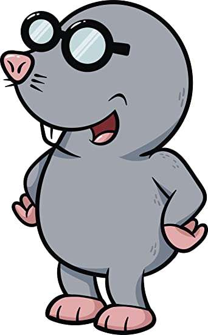

# Match-a-Mole

In this activity you will build a matching game that has a timer, keeps track of a user's score, and allows a user to save their score.  HTML, JavaScript (JS), and Bootstrap will be need to complete this project. This activity will review basic HTML forms, DOM manipulation with JS, and localstorage.   

[Live Link](https://ccrum292.github.io/Match-a-Mole/)

## Instructions

* This activity will be broken into three 30 minute intervals.

* Steps

  * Step 1 (20 min): Open script.js within the Unsolved Folder and work on Completing the Init, displayMoles, and setMole Functions and add an event listener to the time cap form.
    * Return to Main Room to Review (10 min)
  * Step 2 (20 min): Within the same file, work on functions tickUp, countMatch, and end.
    * Return to Main Room to Review (10 min)
  * Step 3 (20 min): Within the same file, add an event listener to the save form and work on the saveScoreAndMoveUser function.  Next, move to highScoresScript.js and complete the work there.
    * Return to Main Room to Review (10 min)